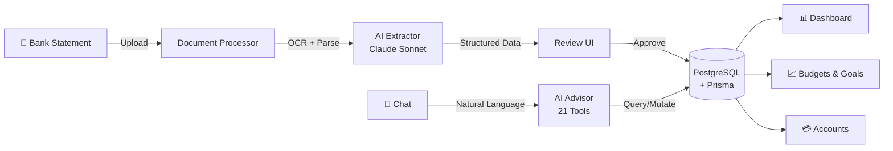

# 💰 AI Finance Manager

> Upload a bank statement. AI extracts every transaction, categorizes your spending, and becomes your personal financial advisor.


---

## Why This Exists

Bank statements are a mess. PDFs with weird formatting, CSVs with inconsistent columns, Excel files from 9 different Indian banks — each with their own layout. Manually entering transactions is tedious. Categorizing them is worse.

This app solves that: **drop in a bank statement → AI does the rest.**

---

## Architecture



---

## What It Does

### 🤖 AI-Powered

| Feature | How It Works |
|---------|-------------|
| **Smart Document Processing** | Upload PDF, Excel, CSV, TXT → AI extracts every transaction with date, amount, merchant, category |
| **AI Financial Advisor** | Chat interface with **21 specialized tools** — ask "where am I spending the most?" and get real answers from your data |
| **Auto-Categorization** | AI categorizes transactions (Food, Shopping, Utilities, Transport, etc.) — no manual tagging |
| **Bank Detection** | Automatically identifies which bank the statement is from and applies the right parser |
| **Merchant Normalization** | Cleans up raw text — "PAYPAL *NETFLIX" → "Netflix", "POS 4523 SWIGGY" → "Swiggy" |

### 💼 Core Features
- **Review-First Workflow** — Extract → Review → Edit → Import (you stay in control)
- **Multi-Account** — Bank accounts, credit cards, wallets, investments, loans
- **Dashboard** — Income vs expenses, trends, net worth, spending breakdown
- **Budgets** — Monthly budgets by category with progress tracking
- **Goals** — Savings goals with contribution tracking
- **Credit Health** — Credit card utilization, payment tracking
- **20 Prisma Models** — User, Account, Transaction, Document, Budget, Goal, Investment, Loan, CreditCard, ChatRoom, and more

### 🏦 Indian Bank Parsers
Built-in parsers for **9 Indian banks**: HDFC, SBI, ICICI, Axis, Kotak, PNB, BOB, Canara, Union Bank. Each handles that bank's specific statement format.

---

## Tech Stack

| Layer | Technology | Why |
|-------|-----------|-----|
| **Backend** | Express.js + TypeScript | Fast, typed, battle-tested |
| **AI** | Anthropic Claude (Sonnet) | Best at structured extraction |
| **Database** | PostgreSQL + Prisma ORM | 20 models, type-safe queries |
| **Frontend** | Next.js + React 18 + MUI | Modern, responsive |
| **Queue** | Bull + Redis | Background document processing |
| **Auth** | JWT + bcrypt | Secure session management |
| **Testing** | Jest + Playwright | 31 test files, unit + E2E |

---

## The AI Chat (21 Tools)

The chat isn't a gimmick — it has real tools that read and write your financial data:

**Read Tools (14):**
`get_accounts` · `get_transactions` · `get_budgets` · `get_goals` · `get_categories` · `get_spending_summary` · `get_income_summary` · `get_net_worth` · `get_investments` · `get_loans` · `get_credit_cards` · `get_credit_health` · `get_insights` · `get_alerts`

**Write Tools (7):**
`create_transaction` · `create_budget` · `create_goal` · `update_transaction` · `contribute_to_goal` · `create_account` · `categorize_transactions`

Ask in plain English:
- *"How much did I spend on food this month?"*
- *"Add ₹500 expense for groceries today"*
- *"What's my savings rate?"*
- *"Show me my top 5 spending categories"*

---

## Quick Start

```bash
# Clone
git clone https://github.com/abhiFSD/AI-Finance-Manager.git
cd AI-Finance-Manager

# Backend
npm install
cp .env.example .env    # Add your Anthropic API key
npx prisma generate
npx prisma db push

# Frontend (separate terminal)
cd finance-app
npm install
npm run dev

# Seed test data
npm run seed
# Login: john.doe@example.com / Password123!
```

**Requirements:** Node.js 18+, Redis (for job queues), Anthropic API key

---

## Project Structure

```
├── src/                          # Backend (Express + TypeScript)
│   ├── api/                      # Route handlers
│   ├── services/
│   │   ├── ai-chat.service.ts    # AI advisor (21 tools)
│   │   ├── ai-tools.ts           # Read-only financial tools
│   │   ├── ai-tools-crud.ts      # Write tools
│   │   ├── parsers/              # 9 Indian bank parsers
│   │   ├── extraction/           # Transaction extraction
│   │   ├── categorization/       # Auto-categorization
│   │   ├── ocr/                  # Document OCR
│   │   ├── analytics/            # Spending analytics
│   │   └── automation/           # Recurring transactions
│   ├── middleware/                # Auth, rate limiting
│   └── workers/                  # Background job processor
├── finance-app/                  # Frontend (Next.js + React)
│   ├── src/app/                  # Pages (dashboard, chat, etc.)
│   ├── src/components/           # Reusable UI components
│   └── src/store/                # State management
├── prisma/
│   └── schema.prisma             # 20 models
└── test-data/                    # Bank statement samples
```

---

## API Endpoints

| Method | Endpoint | What It Does |
|--------|----------|-------------|
| POST | `/api/auth/register` | Register |
| POST | `/api/auth/login` | Login → JWT |
| POST | `/api/documents/upload/single` | Upload bank statement |
| GET | `/api/documents/:id` | Get extracted data |
| POST | `/api/documents/:id/import` | Import reviewed transactions |
| GET | `/api/transactions` | List transactions (filterable) |
| POST | `/api/chat/rooms/:id/messages` | Chat with AI advisor |
| GET | `/api/analytics/spending` | Spending breakdown |
| GET | `/api/net-worth` | Net worth calculation |

---

## License

MIT — use it, learn from it, build on it.
